<!-- Scoped style -->
<style scoped>
section {
  font-size: 22px;
}
</style>

# Summary

<br />
<br />
<br />

<div class="columns">
<div>

1. Data Assimilation  
  1.1 What is Data Assimilation?  
  1.2 Motivation  
  1.3 Mathematical Intuition  

2. Determination of the Initial Condition  
  2.1 Evolution of Data Assimilation Skill  
  2.2 CPTEC Numerical Modeling and Data Assimilation System  
  2.3 Gridpoint Statistical Interpolation  

</div>
<div>

3. R2O – Research to Operations  
  3.1 What is R2O and why is it necessary?  
  3.2 Supporting Tools  
  3.3 Transition Workflow  

4. Operational Activities  
  4.1 Operational Cost  
  4.2 Monitoring  
  4.3 Comparisons with Other Numerical Products  

5. Conclusions

</div>
</div>

---


# 1. Data Assimilation

<br />

## **1.1 What is Data Assimilation?**

<br />
<br />

<div class="columns">
<div>

- Data Assimilation comprises a set of techniques that allow the optimal combination of observations and numerical forecasts while taking their respective errors into account  
  * Observations are irregularly distributed in space  
  * Forecasts are presented on a regular grid  
  * Combining both results in an updated/corrected forecast, which we call the analysis  

</div>
<div>

* The analysis is the initial condition of numerical models  

<div align="center">
  
  <figcaption>Source: https://www.data-assimilation.riken.jp/en/research/index.html</figcaption>
</div>

</div>
</div>

---


# 1. Data Assimilation

<br />

## **1.2 Motivation**

<br />
<br />
<br />

- 👉 Models and observations have uncertainties  
  * 🔴 Models  
    * 🖥️ Discretization of equations, physical parameterizations, etc.  
  * 🔵 Observations  
    * 🪛 Instrument calibration, measurement location (e.g., proximity to rivers), recording errors, etc.  
* ⏺️ Data assimilation needs to account for these factors so that these uncertainties can weight their contributions  
  * 👉 The higher the model/observation error, the lower its precision and, consequently, the lower its weight

---


# 1. Data Assimilation

<br />

## **1.3 Mathematical Intuition**
 
<br /> 
 
<div class="columns">
<div>

- Writing this combination between observation and forecast as a linear combination:

$$
x_a = \alpha y_o + (1 - \alpha) x_b
$$
 
- Where:
  - $x_a$ is the analysis
  - $x_b$ is the forecast
  - $y_o$ is the observation
  - $\alpha$ is the weight given to the observation
  - $1 - \alpha$ is the weight given to the forecast
  
- For it to be a linear combination, the sum of the weights must equal 1 👍

</div>
<div>

- How should the weight $\alpha$ be determined?

<div align="center">
  
</div>

</div>
</div>

---


# 1. Data Assimilation

<br />

## **1.3 Mathematical Intuition**

<br />

- $\alpha$ is a parameter that relates the variance of the observation and the model

<br /> 

$$
\alpha = \frac{\sigma_{b}^{2}}{\sigma_{b}^{2} + \sigma_{o}^{2}}
$$
 
<br /> 
 
- Where:
  - $\sigma_{b}^{2}$ and $\sigma_{o}^{2}$ are the variances of the background and the observations, respectively
 
<br /> 
  
- 👉 Therefore, $\alpha$ can be understood as a parameter representing the ratio between the model error variance and the total system error variance (model + observation)

---


# 1. Data Assimilation

<br />

## **1.3 Mathematical Intuition**

<br />
<br />

<div class="columns">
<div>

<br />
<br />

- Consider a simple mathematical model, the sine function with added normally distributed noise:

$$
f(x) = \sin(x) + \varepsilon, \quad \varepsilon \sim \mathcal{N}(0, \sigma^2), \quad -\pi \le x \le \pi
$$

</div>
<div>

<div align="center">
  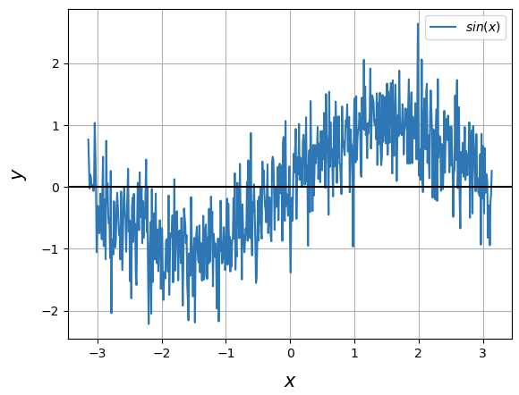
</div>

</div>
</div>

---


# 1. Data Assimilation

<br />

## **1.3 Mathematical Intuition**

<br />

- We define a full domain where we apply the model to extract information as a "forecast" and "observations"

<div class="columns">
<div>

<div align="center">
  <figcaption>xb = sine function applied to domain x0</figcaption>
  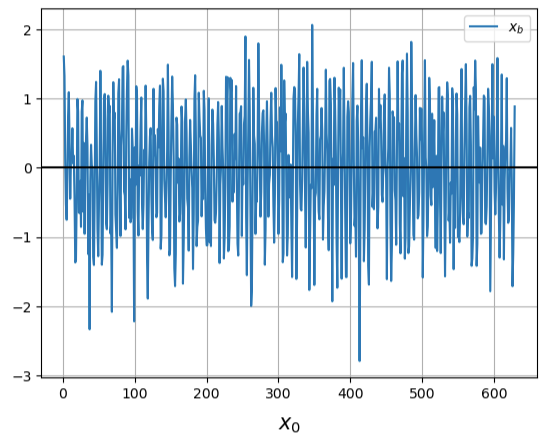
</div>

</div>
<div>

<div align="center">
  <figcaption>y = Observations (same nature as xb)</figcaption>
  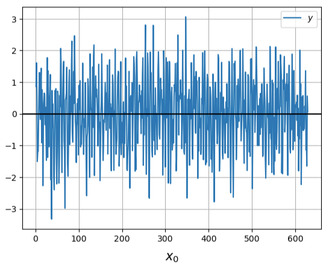
</div>

</div>
</div>

---


# 1. Data Assimilation

<br />

## **1.3 Mathematical Intuition**

<br />

- $x_b$ and $y_o$ follow a normal distribution, both represented by random values over a normal curve with $\mu_{x_b} = 0.0019$, $\sigma_{x_b} = 0.8909$ and $\mu_{y_o}=-0.011$, $\sigma_{y_o}=0.8563$

<br />

<div align="center">
  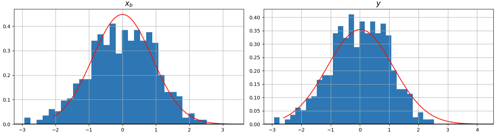
</div>

---


# 1. Data Assimilation

<br />

## **1.3 Mathematical Intuition**

<br />

- Define the error series for forecasts and observations

<div class="columns">
<div>

<div align="center">
  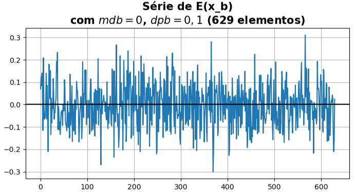
</div>

</div>
<div>

<div align="center">
  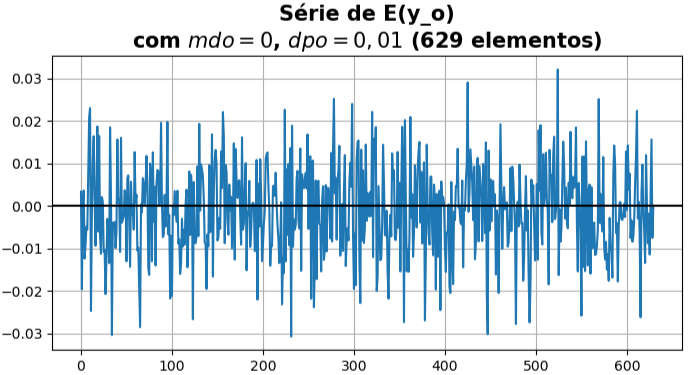
</div>

</div>
</div>

---


# 1. Data Assimilation

<br />

## **1.3 Mathematical Intuition**

<br />

- Checking the error distributions of "forecast" and "observation"

<div class="columns">
<div>

<div align="center">
  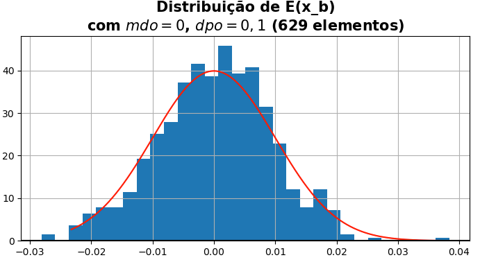
</div>

</div>
<div>

<div align="center">
  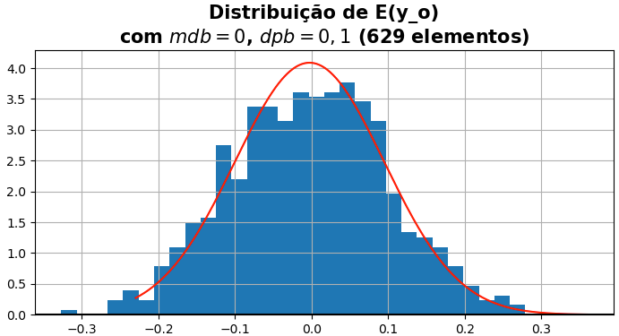
</div>

</div>
</div>

---


# 1. Data Assimilation

<br />

## **1.3 Mathematical Intuition**

<div class="columns">
<div>

<br />

### Why the Normal Distribution?

<br />

- We keep the distributions of $x_{b}$ and $y_{o}$ close to a normal distribution because it has the following properties:

<br />

$$
f(\psi) = \frac{1}{\sigma\sqrt{2\pi}}{e}^{-\frac{(\psi-\mu)^{2}}{2\sigma^{2}}}
$$

</div>
<div>

<br />

- ~68% of values lie within 1σ of the mean
- ~95% of values lie within 2σ of the mean
- ~99.7% of values lie within 3σ of the mean

<div align="center">
  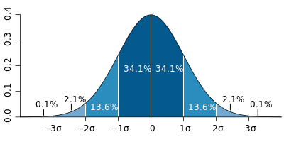
</div> 

</div>
</div>

---


# 1. Data Assimilation

<br />

## **1.3 Mathematical Intuition**

<br />
 
<div class="columns">
<div>

- From this information, we calculate
  - The variance of forecast and observation errors

```
sigmab2 = np.var(errb)
sigmao2 = np.var(erro)
```

```
sigmab2 = 0.0095226361060977
sigmao2 = 0.00011333207595536619
```


</div>
<div>

- The variance of observation errors is much smaller than the variance of background errors
 
- The value of $\alpha = \frac{\sigma_{b}^{2}}{\sigma_{b}^{2} + \sigma_{o}^{2}}$

```
alpha = sigmab2 / (sigmab2 + sigmao2)
alpha = 0.9882386415340758
```


</div>
</div> 

---


# 1. Data Assimilation

<br />

## **1.3 Mathematical Intuition**

<br />
 
<div class="columns">
<div>

- The value $\alpha \approx 0.99$ indicates that 99% of the weight in the linear combination between $x_b$ and $y_o$ is given to the observations, while 1% of the weight is given to the background

$$
x_{a} = \alpha y_{o} + (1-\alpha) x_{b}
$$

- For further exploration
  - 🎲 Jupyter notebook with univariate empirical analysis [](https://colab.research.google.com/github/cfbastarz/MET563-3/blob/main/atividade_01_equacao_de_analise_empirica.ipynb)
  - 🎲 Jupyter notebook with multivariate empirical analysis [](https://colab.research.google.com/github/cfbastarz/MET563-3/blob/main/atividade_02_equacao_de_analise_empirica_multi.ipynb)

</div>
<div>

<br />

<div align="center">
  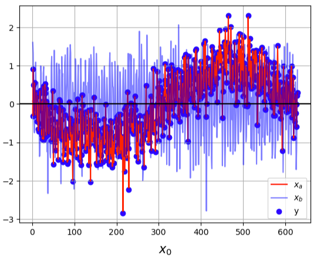
</div> 

</div>
</div>

---


# 1. Data Assimilation

<br />

## **1.3 Mathematical Intuition**

<br />

- In real-world, multivariate, and multidimensional problems, the weight $\alpha$ is represented by error covariance matrices, which require modeling and approximations for their representation 👉 we have limited control or influence over these errors

- Optimal Interpolation

$$
\mathbf{x}_{a} = \mathbf{x}_{b} + \mathbf{W}[\mathbf{y} - H(\mathbf{x}_{b})], \quad \mathbf{W} = \mathbf{BH}^{\text{T}}(\mathbf{HBH}^{\text{T}}+\mathbf{R})^{-1}
$$

- Where
  - $\mathbf{x}_{a}$ is the analysis vector (estimated state)
  - $\mathbf{x}_{b}$ is the background vector (first guess)
  - $\mathbf{y}$ is the observation vector
  - $\mathbf{W}$ is the weight (or gain) matrix
  - $H$ is the nonlinear observation operator (maps model space to observation space)
  
---


# 2. Determining the Initial Condition

<br />

## **2.1 Evolution of Data Assimilation Skill**

<br />

<div class="columns">
<div>

- 📈 Evolution of forecast skill for 500 hPa geopotential height
  * In the early 1980s, the 7-day forecast skill for the Northern Hemisphere did not exceed 50%, and was below 40% in the Southern Hemisphere
  * Over time, the skill difference between hemispheres decreased drastically, becoming very similar by the 2000s
  * Only from the mid-1990s did 10-day forecasts start reaching some skill (~30%)...
  * Currently, 10-day forecasts already reach 50% skill for both hemispheres

</div>
<div>

  * Although improvements were significant, it seems short-term forecast skill is approaching its limit - **why?**

<div align="center">
  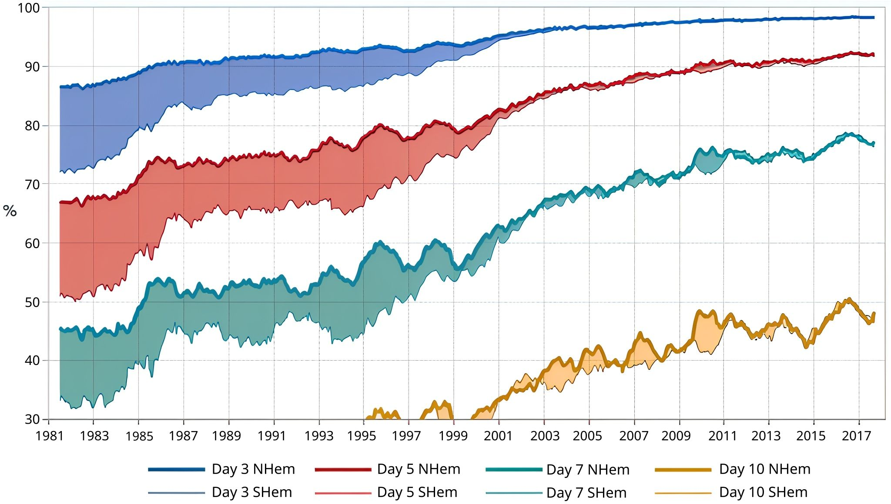
</div>

</div>
</div>

---


# 2. Determining the Initial Condition

<br />

## **2.2 CPTEC Numerical Modeling and Data Assimilation System**

<br />

- SMNA is CPTEC's data assimilation system
  * Global spectral model BAM (Brazilian Atmospheric Model)
  * Data assimilation framework GSI (Gridpoint Statistical Interpolation)
  * Provides analysis for the BAM model at spatial resolution TQ0299L064 
    * 👉 TQ0299 = triangular spectral truncation of order 299, using quadratic Gaussian grid
    * 👉 L064 = 64 vertical levels in hybrid sigma-pressure coordinates

* At CPTEC, the combination of BAM model and GSI has been applied since 2012
  * With updates to the atmospheric model (surface model, convective parameterization, vertical coordinate)
  * With updates to the GSI version (including new observation types, covariance matrix updates, etc.)
  
---


# 2. Determining the Initial Condition

<br />

## **2.3 Gridpoint Statistical Interpolation**

<br />

- GSI is a data assimilation framework developed by NCEP
  * Provides software implementation for all components related to data assimilation
    * Variational methods (3D/4DVar, FGAT, hybrid-variational, 3D/4DEnVar)
    * Ensemble-based methods (EnKF, EnSRF, LETKF)
    * Minimization of the variational cost function
    * Observation operator $H$ (Radiative Transfer Model)
    * Support for global (spectral) and regional (grid-point) models
* Maintained by DTC/NCAR
  * Centralizes contributions, manages the code, distributes releases, and provides tutorials for the user community
  * 🔗 [https://ral.ucar.edu/solutions/products/gridpoint-statistical-interpolation-gsi](https://ral.ucar.edu/solutions/products/gridpoint-statistical-interpolation-gsi)

---


# 2. Determining the Initial Condition

<br />

## **2.3 Gridpoint Statistical Interpolation**

<br />

### ⚙️ 3DVar
 
- 3DVar is a variational data assimilation method that finds the best initial state of the atmosphere (or ocean) by adjusting an analysis that minimizes the difference between observations and the background, weighted by their errors (covariance matrices)

- **Cost Function**

  $$
  J(\mathbf{x}) =
  \frac{1}{2}(\mathbf{x} - \mathbf{x}_b)^{\text{T}}\mathbf{B}^{-1}(\mathbf{x} - \mathbf{x}_b)
  + \frac{1}{2}[\mathbf{y}_o - H(\mathbf{x})]^{\text{T}}\mathbf{R}^{-1}[\mathbf{y}_o - H(\mathbf{x})]
  $$

- **Gradient**

  $$
  \nabla J(\mathbf{x}) = (\mathbf{B}^{-1}+\mathbf{H}^\text{T}\mathbf{R}^{-1}\mathbf{H})(\mathbf{x}-\mathbf{x}_b) - (\mathbf{H}^\text{T}\mathbf{R}^{-1}) [\mathbf{y}_{o}-H(\mathbf{x}_b)] = 0
  $$
  
- **Exact Analytical Solution**

  $$
  \mathbf{x}_a = \mathbf{x}_b + \mathbf{W}[\mathbf{y}_o - H(\mathbf{x}_b)], \quad \mathbf{W} = \mathbf{BH}^{\text{T}}(\mathbf{HBH}^{\text{T}}+\mathbf{R})^{-1}
  $$

---


# 2. Determining the Initial Condition

<br />

## **2.3 Gridpoint Statistical Interpolation**

<br />

### ⚙️ FGAT
 
<div class="columns">
<div>

- FGAT (First Guess at Appropriate Time) uses the background at the observation time to improve temporal consistency in 3DVar
  - Cost function remains 3D, as the background correction does not evolve over time
  - Improves temporal alignment of observations that are not at the analysis time (e.g., non-conventional observations)
  - Requires the first guess to be partitioned over the assimilation window

</div>
<div>

$$
J(\mathbf{x}) = \frac{1}{2}(\mathbf{x} - \mathbf{x}_b(t_{0}))^T \mathbf{B}^{-1} (\mathbf{x} - \mathbf{x}_b(t_{0})) + \frac{1}{2}\sum_i [\mathbf{y}_i - H_i(\mathbf{x}(t_i))]^T \mathbf{R}_i^{-1} [\mathbf{y}_i - H_i(\mathbf{x}(t_i))]
$$

<br />
  
<div align="center">
  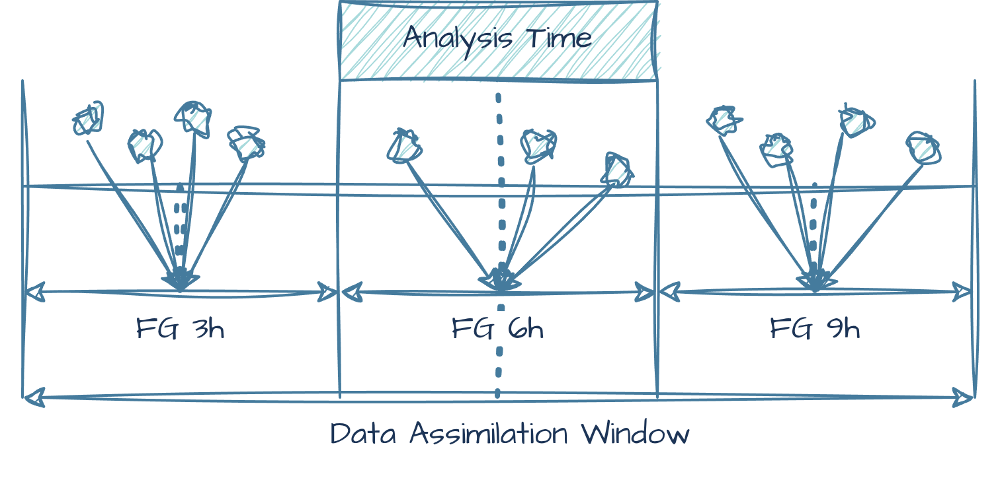
</div>

</div>
</div>

---


# 2. Determining the Initial Condition

<br />

## **2.3 Gridpoint Statistical Interpolation**

<br />

### ⚙️ Observation Operator $\mathbf{H}$

- Responsible for mapping the model background to the observation space
  - If $y_o$ and $x_b$ are equivalent quantities (e.g., temperatures), then $\mathbf{H}$ performs only an interpolation and the innovation is calculated as $y_o - H(x_b)$
  - If $y_o$ is a radiance, then $\mathbf{H}$ needs to compute a radiance profile from $x_b$ to calculate the innovation
    * In this case, $\mathbf{H}$ is a radiative transfer model (in the SMNA, it is CRTM - Community Radiative Transfer Model)

---


# 2. Determining the Initial Condition

<br />

## **2.3 Gridpoint Statistical Interpolation**

<br />

### ⚙️ Covariance Matrix $\mathbf{B}$

- Sources of uncertainty in the modeling process are represented by:
  * Numerical model (e.g., dynamics and physics)
  * Observations (e.g., measurement, instrument, processing level)
  * Data assimilation system (e.g., observation operators, adjoint and tangent-linear models, ensemble size)

* The forecast error covariance matrix ($\mathbf{B}$) represents the covariance of the model "error" (an estimate)
  
* In data assimilation, these errors are modeled in covariance matrices that account for spatiotemporal relationships between observed and diagnosed/prognosed quantities

* 3DVar cost function:

  $$
  J(\mathbf{x}) = \frac{1}{2} (\mathbf{x} - \mathbf{x}^{b})^{T} {\color{red}{\mathbf{B}^{-1}}} (\mathbf{x} - \mathbf{x}^{b}) + \frac{1}{2} [\mathbf{y}^{o} - {\color{green}{\mathbf{H}}}(\mathbf{x})]^{T} {\color{blue}{\mathbf{R}^{-1}}} [\mathbf{y}^{o} - {\color{green}{\mathbf{H}}}(\mathbf{x})]
  $$

  
---


# 2. Determining the Initial Condition

<br />

## **2.3 Gridpoint Statistical Interpolation**

<br />

### ⚙️ Covariance Matrix $\mathbf{B}$

<div class="columns">
<div>

- **NMC Method (National Modeling Center)**

  - The NMC method assumes that the spatial correlation of model errors is similar to the spatial correlation of differences between 48- and 24-hour forecasts
  - **Assumption:** linear growth of forecast errors during the first hours of prediction
  
- Example of a valid forecast pair (BAM model)
  - <span style="color: red;">2013122418</span>-<span style="color: blue;">2013122618</span> (48-hour forecast)
  - <span style="color: red;">2013122518</span>-<span style="color: blue;">2013122618</span> (24-hour forecast)

</div>
<div>

<div align="center">
  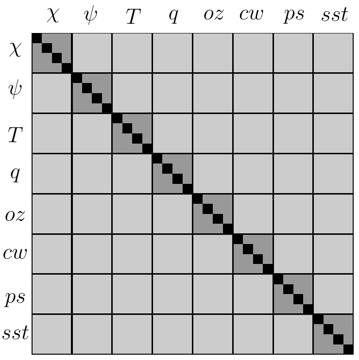
</div>

</div>
</div> 
 
---


# 2. Determining the Initial Condition

<br />

## **2.3 Gridpoint Statistical Interpolation**

<br />

### ⚙️ Observation Quality Control

<div class="columns">
<div>

<br />

- This step occurs before and during data assimilation
  - Before, it involves preparing observation data (at CPTEC, this means creating their own prepBUFR files for conventional and radiance data)
  - During assimilation, GSI performs multiple checks and tests
- Generally, there is a type of quality control for each observation type

</div>
<div>

- 🧑‍🔬 **Pre-QC:** for radiosondes, checks altitude, pressure, temperature, humidity, and removes duplicate data; for radiances, applies provider flags, cloud cover, and viewing angle checks
- 🧑‍🔬 **OMF:** calculates innovations $\mathbf{y}_o - H(\mathbf{x}_b)$ and compares them with $\mathbf{B}$ and $\mathbf{R}$ variances
- 🧑‍🔬 **Buddy Check:** compares observations with neighbors (can reject or reduce weights of observations)
- 🧑‍🔬 **Adaptive/Variational QC:** adjusts observation weights instead of immediately discarding them

</div>
</div>

---


# 2. Determining the Initial Condition

<br />

## **2.3 Gridpoint Statistical Interpolation**

<br />

<div class="columns">
<div>

### ⚙️ Observations Assimilated by SMNA

- Currently, the following observation datasets are assimilated in CPTEC's SMNA
  - 🌡️ Conventional observations: $u$, $v$, $t$, $q$, and $ps$
  - 🛰️ Non-conventional satellite/instrument observations:
    - AMSUA/METOP-B (microwave, infers $t$)
    - SATWND (infers $u$ and $v$)
    - GPSRO (GPS signal refraction, bending angle, infers $t$, $p$, and $q$)

</div>
<div>

<div align="center">
  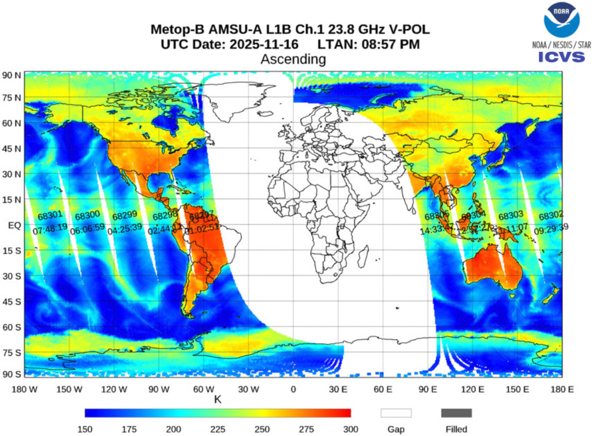
</div>

<div align="center">
  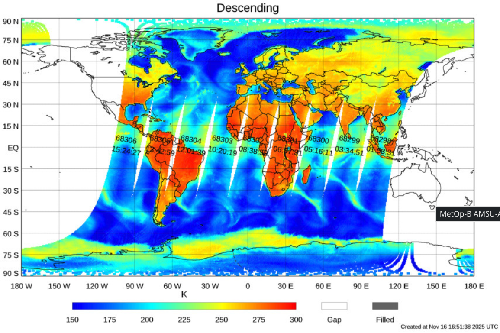
</div>
<figcaption>Source: https://www.star.nesdis.noaa.gov/icvs/status_MetOPB_AMSUA.php</figcaption>
</div>
</div>
    
---


# 2. Determining the Initial Condition

<br />

## **2.3 Gridpoint Statistical Interpolation**

<br />

### ⚙️ Data Assimilation Cycle
 
<br /> 
 
<div align="center">
  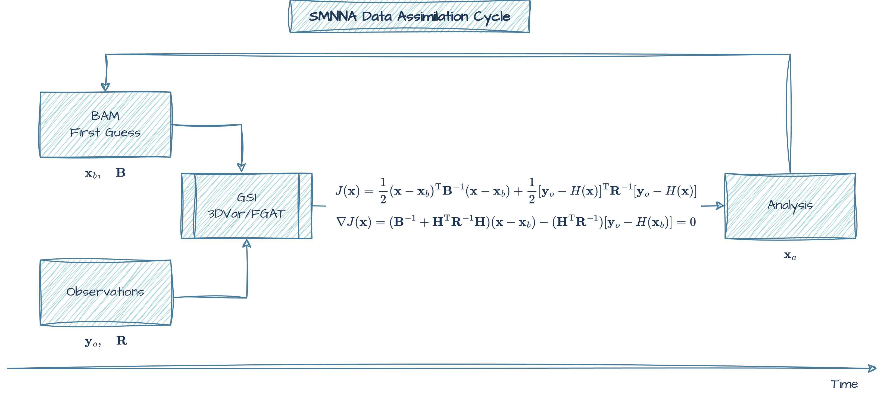
</div> 
 
---


# 3. R2O - Research to Operations

<br />

## **3.1 What is R2O and Why is it Necessary?**

<div class="columns">
<div>

- 👉 A crucial step for maintaining and developing the operational data assimilation suite
  * This is when research results are transferred along with new developments to the operational environment
  * Computational artifacts produced in research can also serve as operational diagnostic tools
* 🃏 Challenges:
  * Technical limitations often linked to computational capacity (processing and storage)
  * Proper validation, outperforming the previous version, and comparison with other products
  
</div>
<div>

<div align="center">
  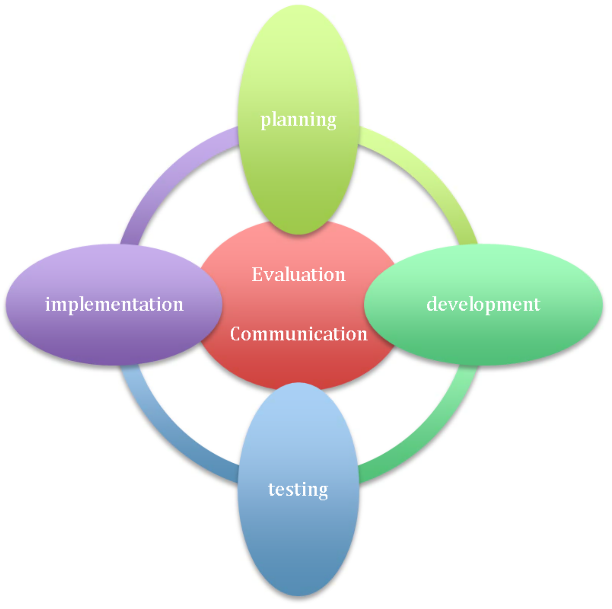
  <figcaption>Source: https://www.ecmwf.int/sites/default/files/elibrary/2017/17549-ecmwf-research-operations-r20-process.pdf</figcaption>
</div>

</div>
</div>

---

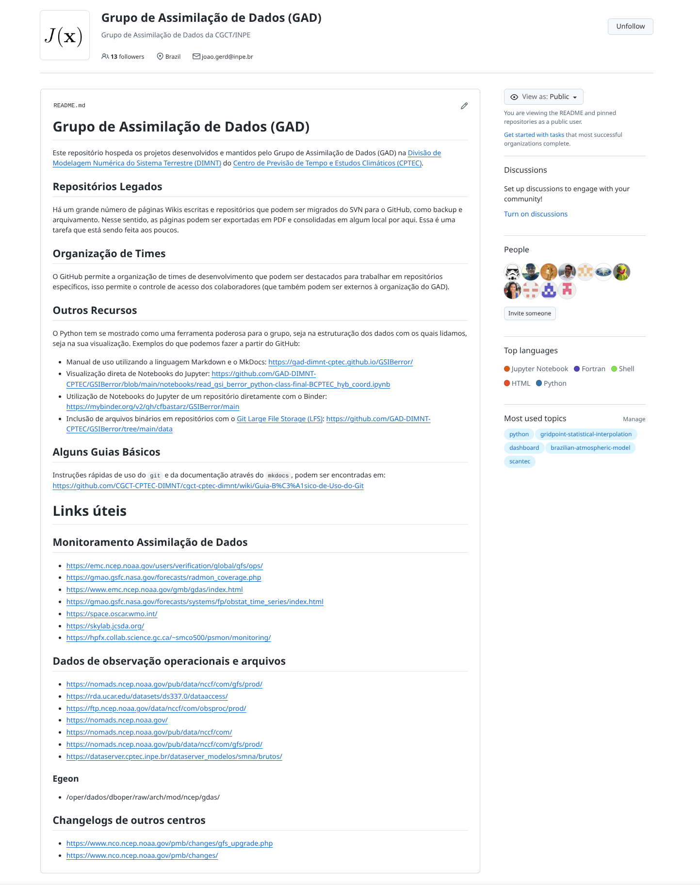

# 3. R2O - Research to Operations

<br />

## **3.2 Support Tools**

<br />
<br />

- The Data Assimilation Group maintains an organization on GitHub
  - Facilitates team organization and development tracking
    * 🗺️ Roadmaps
    * 🏷️ Tags and releases for distribution
    * 📋 Issue tracking
    * 🗣️ Discussions
    * 📄 Wikis, etc.
    * 🔗 [https://github.com/GAD-DIMNT-CPTEC](https://github.com/GAD-DIMNT-CPTEC)

---


# 3. R2O - Research to Operations

<br />

## **3.2 Support Tools**
   
### Examples of Support Tools    
   
<div class="columns">
<div>

- **readDiag**
  * Tool for diagnosing radiance assimilation in GSI (Python)

- **GSIBerror**
  * Tool for diagnosing the GSI background error covariance matrix (Python)

- **pyBAM**
  * Tool to read BAM forecast fields (recomposes spectral coefficients to physical space, Python)

- **SCANTEC**
  * Community System for Evaluation of Numerical Weather and Climate Models (Fortran)  
  
</div>
<div>
  
- **SCANPLOT**
  * Plotting system for SCANTEC (Python)
  
- **SMNAMonitoringApp**
  * Tool for monitoring operational SMNA simulations (under development, Python)

- **Observation Impact and Observing System Experiments**
  * Diagnostic tools to study the impact and contribution of different observation types on the analysis 
  
</div>
</div>
  
<div>
  
</div>
  
---


# 3. R2O - Research to Operations

<br />

## **3.2 Support Tools**    
   
<br />
   
### Examples of Support Tools    
  
  
<div class="columns">
<div>

- **readDiag**
  - 🪛 Tool for diagnosing radiance assimilation in GSI (Python)
  - 🔗 [https://gad-dimnt-cptec.github.io/readDiag](https://gad-dimnt-cptec.github.io/readDiag)
  - 🐙 [https://github.com/GAD-DIMNT-CPTEC/readDiag](https://github.com/GAD-DIMNT-CPTEC/readDiag)
  - 📓 Jupyter notebooks available for testing
  - 🐍 Available on PyPi
  - 📄 Documentation in Portuguese and English
  
</div>
<div>

<div align="center">
  
</div>

</div>
</div>

<div>
  
</div>

---


# 3. R2O - Research to Operations

<br />

## **3.2 Support Tools**    
   
<br />
   
### Examples of Support Tools    
  
<div class="columns">
<div>

- **GSIBerror**
  - 🪛 Tool for diagnosing the GSI background error covariance matrix (Python)
  - 🔗 [https://gad-dimnt-cptec.github.io/GSIBerror](https://gad-dimnt-cptec.github.io/GSIBerror)
  - 🐙 [https://github.com/GAD-DIMNT-CPTEC/GSIBerror](https://github.com/GAD-DIMNT-CPTEC/GSIBerror)
  - 📓 Jupyter notebooks available for testing
  - 🐍 Available on PyPi
  - 📄 Documentation in Portuguese and English

</div>
<div>

<br />
<br />

<div align="center">
  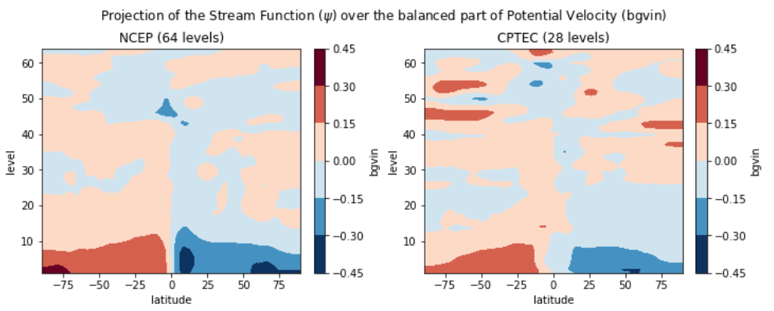
</div>

</div>
</div> 

<div>
  
</div> 

---


# 3. R2O - Research to Operations

<br />

## **3.2 Support Tools**    
   
<br />
   
### Examples of Support Tools    
  
<div class="columns">
<div>

- **pyBAM**
  - 🪛 Tool for reading BAM forecast fields (Python)
  - 🔗 [https://gad-dimnt-cptec.github.io/pyBAM](https://gad-dimnt-cptec.github.io/pyBAM)
  - 🐙 [https://github.com/GAD-DIMNT-CPTEC/pyBAM](https://github.com/GAD-DIMNT-CPTEC/pyBAM)
  - 📄 Documentation only in Portuguese

</div>
<div>

<div align="center">
  
</div>

</div>
</div>
 
<div>
  
</div>

---


# 3. R2O - Research to Operations

<br />

## **3.2 Support Tools**    
   
<br />
   
### Examples of Support Tools    
  
<div class="columns">
<div>

- **SCANTEC**
  - 🪛 Community System for Evaluation of Numerical Weather and Climate Models (Fortran)
  - 🔗 [https://gad-dimnt-cptec.github.io/SCANTEC](https://gad-dimnt-cptec.github.io/SCANTEC)
  - 🐙 [https://github.com/GAD-DIMNT-CPTEC/SCANTEC](https://github.com/GAD-DIMNT-CPTEC/SCANTEC)
  - 📄 Documentation only in Portuguese

</div>
<div>

<br />
<br />

<div align="center">
  
</div>

</div>
</div> 
 
<div>
  
</div>
 
---


# 3. R2O - Research to Operations

<br />

## **3.2 Support Tools**    
   
<br />
   
### Examples of Support Tools    
  
<div class="columns">
<div>

- **SCANPLOT**
  - 🪛 Plotting system for SCANTEC (Python)
  - 🔗 [https://gad-dimnt-cptec.github.io/SCANPLOT](https://gad-dimnt-cptec.github.io/SCANPLOT)
  - 🐙 [https://github.com/GAD-DIMNT-CPTEC/SCANPLOT](https://github.com/GAD-DIMNT-CPTEC/SCANPLOT)
  - 📓 Jupyter notebooks available to test the CLI
  - ⚙️ Demo GUI available at [https://huggingface.co/spaces/cfbastarz/SCANPLOT](https://huggingface.co/spaces/cfbastarz/SCANPLOT)
  - 📄 Documentation only in Portuguese

</div>
<div>

<div align="center">
  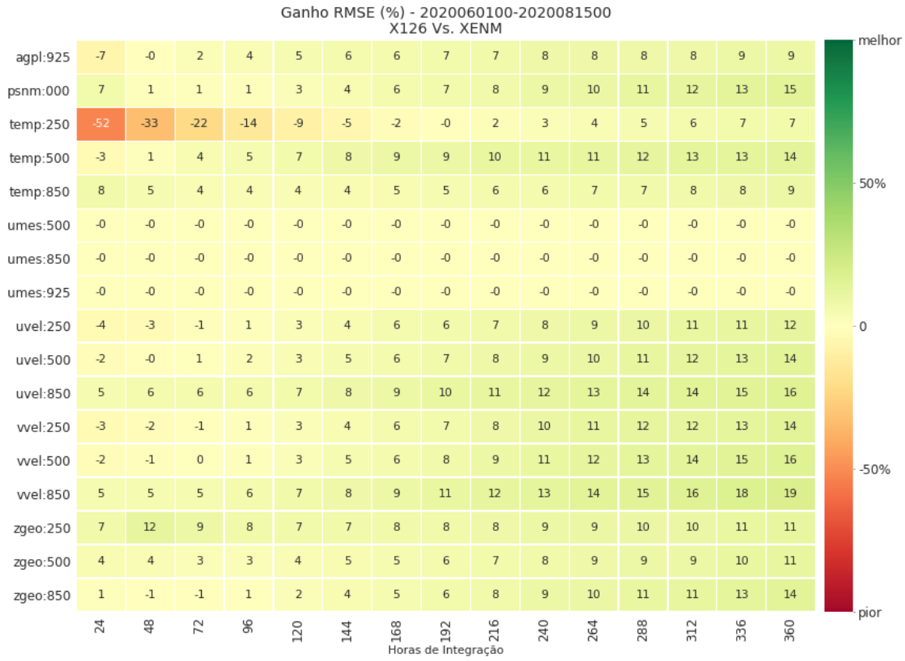
</div>

</div>
</div>
 
<div>
  
</div>

---


# 3. R2O - Research to Operations

<br />

## **3.2 Support Tools**    
   
<br />
   
### Examples of Support Tools    
  
<div class="columns">
<div>

- **SMNAMonitoringApp**
  - 🪛 Tool for monitoring operational SMNA simulations (under development, Python)
  - 🔗 [https://gad-dimnt-cptec.github.io/SMNAMonitoringApp](https://gad-dimnt-cptec.github.io/SMNAMonitoringApp)
  - 🐙 [https://github.com/GAD-DIMNT-CPTEC/SMNAMonitoringApp](https://github.com/GAD-DIMNT-CPTEC/SMNAMonitoringApp)
  - ⚙️ Demo available at [https://huggingface.co/spaces/cfbastarz/SMNAMonitoringApp](https://huggingface.co/spaces/cfbastarz/SMNAMonitoringApp)
  - 📄 Documentation only in Portuguese

</div>
<div>

<div align="center">
  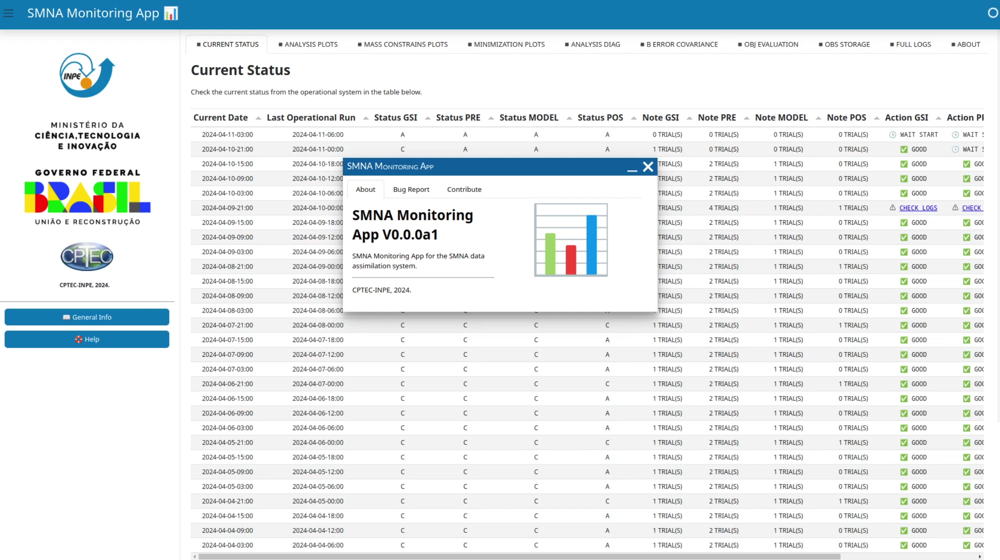
</div>

</div>
</div>
 
<div>
  
</div>
 
---

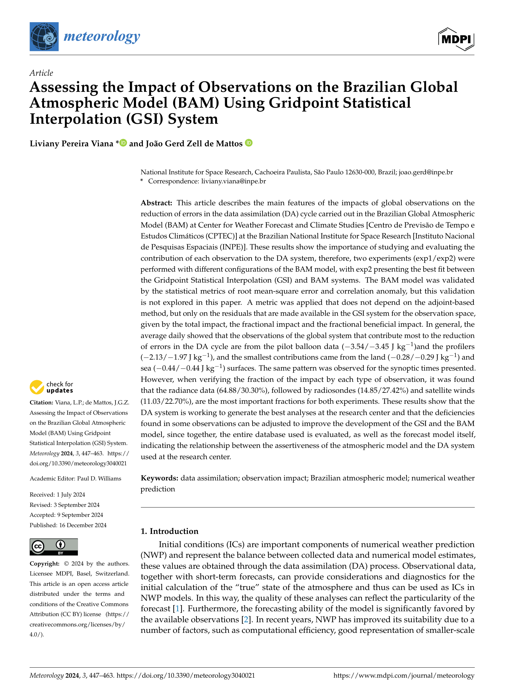

# 3. R2O - Research to Operations

<br />

## **3.2 Support Tools**    
   
<br />
   
### Examples of Support Tools    
  
<div class="columns">
<div>

- **Fractional Observation Impact (Viana & de Mattos, 2024)** 
 
<div align="center">
  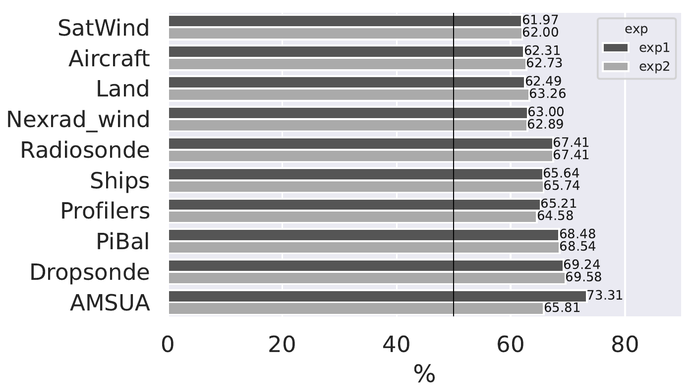
</div>

---

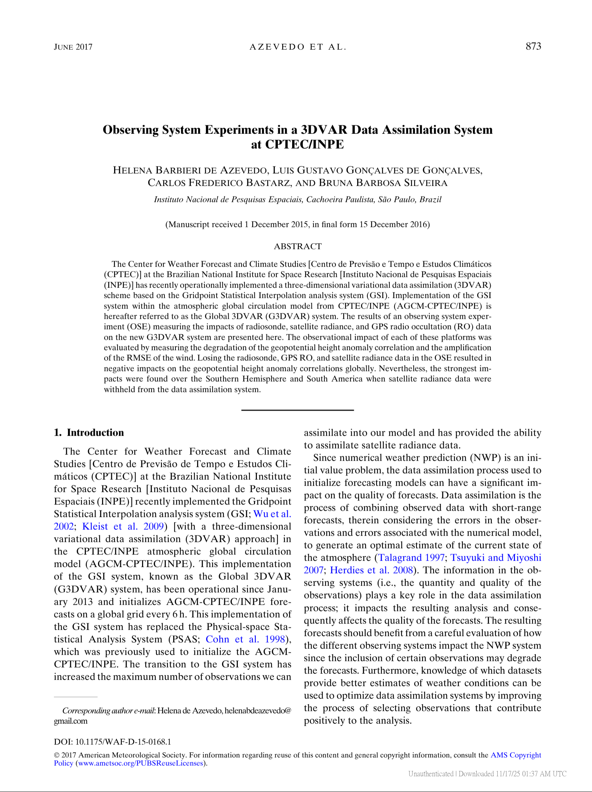

# 3. R2O - Research to Operations

<br />

## **3.2 Support Tools**    
   
<br />
   
### Examples of Support Tools    
  
<div class="columns">
<div>

- **Observing System Experiments (de Azevedo et al., 2016)**
 
<div align="center">
  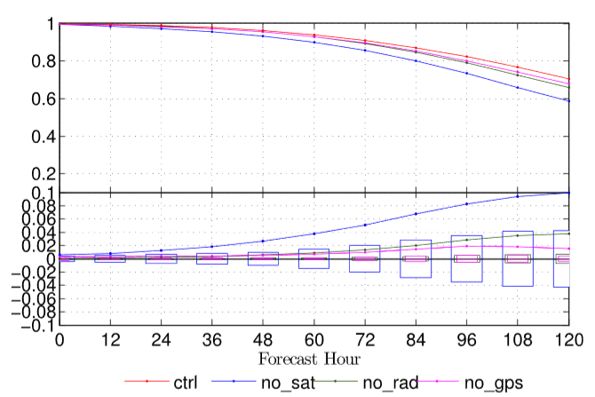
</div> 
 
---


# 3. R2O - Research to Operations

<br />

## **3.3 Transition Workflow**    

- 🤹‍♂️ Project Management
  - 🗺️ Roadmap organization
    - 💡 Goals for each version?
    - 🚕 How to get there?

- 🐙 Development and Version Control
  - 📑 All changes are tracked in the repository (for SMNA, this repository is internal)
  - 👷 Operations report any issues found
  - 🧑‍🔬 Development and research team investigate problems and propose code changes
    - 🧪 New artifacts are generated and used by operations
  - 🔖 Important for operations to log occurrences
    - 🔬 History and system stability assessment
    
- 🗣️ Science Communication
  - 📄 Through reports and technical notes
  - 📜 Scientific articles

---


# 4. Operational Activities

<br />

## **4.1 Operational Cost**    
   
<br />
 
- 💲 Storage cost per SMNA cycle (BAM+GSI)
  - GSI spectral analysis TQ0299L064: ~89MB
  - Spectral background (3x FGAT): ~2GB
  - GSI diagnostic files: ~1.5GB
  - Observation files (AMSUA, GNSS RO, Conventional): ~150MB
  - Other artifacts in the process (GSI): ~3GB
  - Post-processed forecasts for 11 days: ~13GB
- Total: ~20GB
  - 👉 4 cycles per day: ~80GB
  - 👉 1 month: ~10TB
  - 👉 1 year: ~115TB

---


# 4. Operational Activities

<br />

## **4.2 Monitoring**    

<br />
 
- ⚙️ Once the data assimilation system is operational, it is necessary to
  * 🔬 Track daily system simulations in terms of computational performance and analysis/forecast quality (objective evaluation)
  * 🔬 Monitor the operational status of satellite sensors with other centers
  * 🔬 Monitor the dissemination of observation data with other centers (especially at CPTEC, which still does not generate its own observation data)
  * 🫱🏼‍🫲🏽 WMO Events and Meetings 🔗 [link](https://wmo.int/news/events-and-meetings)

---


# 4. Operational Activities

<br />

## **4.3 Comparison with Other Numerical Products**    
  
<br />
  
<div class="columns">
<div>

- Monthly evaluation of CPTEC models
  - 📊 The model evaluation team issues technical reports on the skill of global and regional weather prediction models from INPE, alongside the NCEP GFS model
  - ☔ Significant accumulated precipitation events (e.g., >20mm in 24h) are selected to evaluate model performance
  - 💦 Comparison with MERGE (Rozante et al., 2010: Combining TRMM and Surface Observations of Precipitation: Technique and Validation over South America - 🔗 [link](https://journals.ametsoc.org/view/journals/wefo/25/3/2010waf2222325_1.xml))

</div>
<div>

<br />
<br />

- Models evaluated
  - 👉 BAM (global)
  - 👉 BAM/SMNA (global)
  - 👉 MPAS/MONAN (global)
  - 👉 WRF/CPTEC (regional)
  - 👉 Eta (regional)
  - 👉 BRAMS (regional)

</div>
</div>

---


# 4. Operational Activities

<br />

## **4.3 Comparison with Other Numerical Products**

- Hit Percentage (BAM X SMNA X GFS) – May 2025
  - Number of predicted events that occurred ($\frac{hits}{hits + misses}$)

<div align="center">
  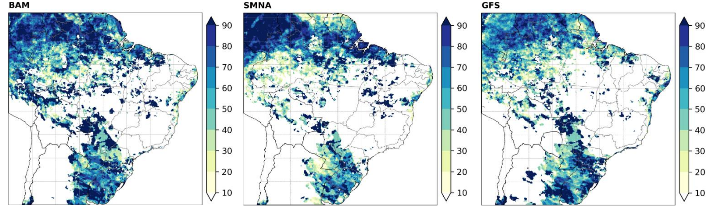
  <figcaption>Source: Model Evaluation Group DIPTC (reproduced)</figcaption>
</div>
 
---


# 4. Operational Activities

<br />

## **4.3 Comparison with Other Numerical Products**

- False Alarm Percentage (BAM X SMNA X GFS) – May 2025
  - Number of predicted events that did not occur ($\frac{fa}{fa + cr}$)

<div align="center">
  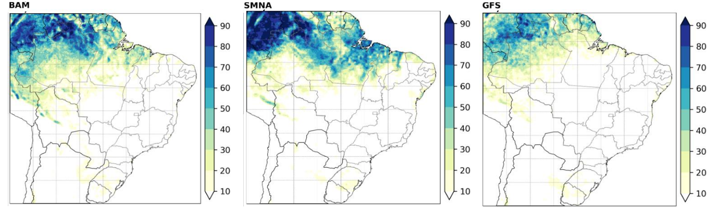
  <figcaption>Source: Model Evaluation Group DIPTC (reproduced)</figcaption>
</div>
 
---


# 4. Operational Activities

<br />

## **4.3 Comparison with Other Numerical Products**

- Miss Percentage (BAM X SMNA X GFS) – May 2025
  - Number of events that occurred but were not forecasted ($\frac{misses}{misses + hits}$)

<div align="center">
  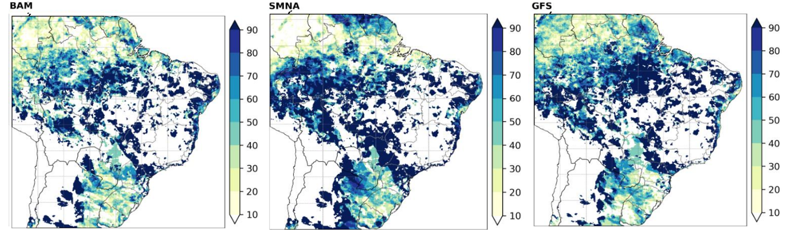
  <figcaption>Source: Model Evaluation Group DIPTC (reproduced)</figcaption>
</div>  
 
---


# 4. Operational Activities

<br />

## **4.3 Comparison with Other Numerical Products**

- Threat Score (BAM X SMNA X GFS) – May 2025 ($\frac{hits}{hits + misses + fa}$)

<div align="center">
  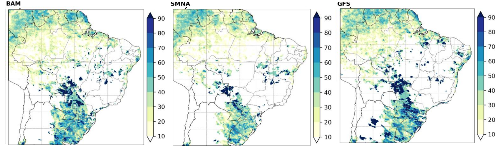
  <figcaption>Source: Model Evaluation Group DIPTC (reproduced)</figcaption>
</div>
 
---


# 4. Operational Activities

<br />

## **4.3 Comparison with Other Numerical Products**

- Bias Ratio (BAM X SMNA X GFS) – May 2025 ($\frac{hits + fa}{hits + misses}$)

<div align="center">
  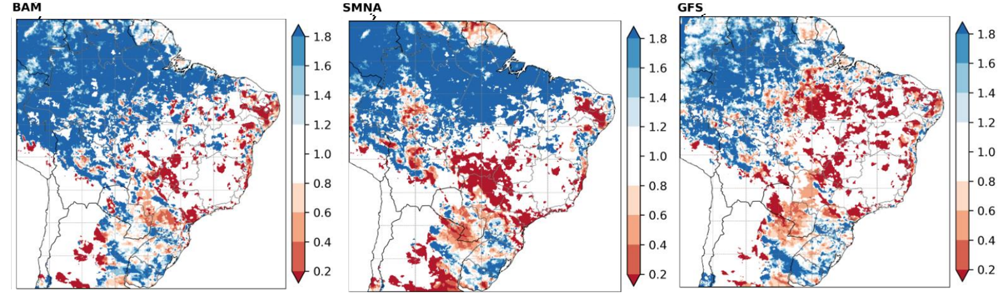
  <figcaption>Source: Model Evaluation Group DIPTC (reproduced)</figcaption>
</div> 

---


# 5. Conclusions
 
- **Initial Condition Determination**
  - 🌉 Data Assimilation is the bridge between observations and the numerical model
  - ⚖️ Combines both sources to produce the best estimate of the optimal state of the atmosphere (or ocean, land surface, etc.)
 
<br /> 
 
- **Research to Operations** 
  - 🛠️ Complexity of the data assimilation framework requires tools to diagnose issues in both operational and research environments
  - 🫱🏼‍🫲🏽 Continuous cycles of development and fixes are applied in the operational system
 
<br /> 
 
- **Operational Activities**
  - 👷🏼 Data assimilation in a NWP center requires collaboration among **modeling**, **scientific computing**, **satellite**, and **database** teams to ensure proper analysis generation
  - 🗣️ Continuous improvement relies on monitoring non-conventional observations and maintaining communication with international satellite groups
  
---


<br />
<br />
<br />
<br />
<br />
<br /> 
<br /> 
 
# Thank You

<br /> 

:octopus: https://github.com/GAD-DIMNT-CPTEC  
:link: https://cfbastarz.github.io  
:email: carlos.bastarz@inpe.br
