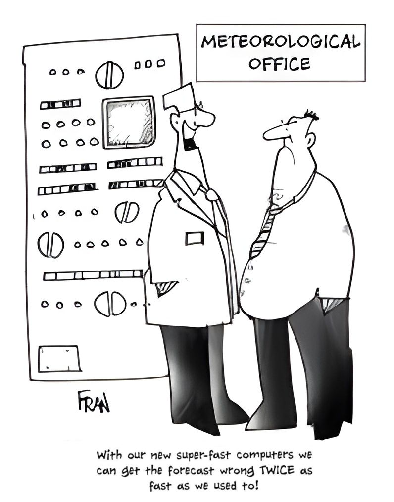

<!-- _footer: "" -->

<!-- _class: title -->


<br />
<br />
<br />
<br />
<br />

# Assimilação de Dados

#### Determinação da Condição Inicial, R2O e Atividades Operacionais

<br />
<br />
<br />
<br />

<span style="color:#FFF; font-size:16px;">
CARLOS FREDERICO BASTARZ

<br />
<br />
<br />

<b>TRAINING COURSE ON WEATHER FORECASTING - AND BEYOND</b>

17 de Novembro de 2025
</span>

<div>
  
</div>  

---


<!-- Scoped style -->
<style scoped>
section {
  font-size: 22px;
}
</style>

# Sumário

<br />
<br />
<br />

<div class="columns">
<div>

1. Assimilação de Dados
  1.1 O que é Assimilação de Dados?
  1.2 Motivação
  1.3 Intuição matemática
2. Determinação da Condição Inicial
  2.1 Evolução do Skill da Assimilação de Dados
  2.2 Sistema de Modelagem Numérica e Assimilação de dados do CPTEC
  2.3 Gridpoint Statistical Interpolation

</div>
<div>

3. R2O – Research to Operations
  3.1 O que é e por que é necessário R2O?
  3.2 Ferramentas de Apoio
  3.3 Fluxo de Transição
4. Atividades Operacionais
  4.1 Custo Operacional 
  4.2 Monitoramento
  4.3 Comparações com outros produtos numéricos
5. Conclusões

</div>
</div>

---


# 1. Assimilação de Dados

<br />

## **1.1 O que é Assimilação de Dados?**

<br />
<br />

<div class="columns">
<div>

- Assimilação de Dados compreende um conjunto de técnicas que permitem a combinação, de forma ótima, de observações e previsões numéricas levando em consideração os seus respectivos erros
  * As observações são espalhadas de forma irregular no espaço
  * As previsões são apresentadas em uma grade regular
  * A combinação de ambos acarreta na atualização/correção da previsão, e isso chamamos de análise
  * 💡 A análise é a condição inicial dos modelos numéricos 

</div>
<div>

<br />

<div align="center">
  
  <figcaption>Fonte: https://www.data-assimilation.riken.jp/en/research/index.html</figcaption>
</div>

</div>
</div>

---


# 1. Assimilação de Dados

<br />

## **1.2 Motivação**

<br />

<div class="columns">
<div>

- Modelos e observações possuem incertezas
  * 🟦 Modelos
    * 🖥️ Discretização das equações, parametrizações físicas etc
  * ⚪ Observações
    * 🪛 Calibração dos instrumentos, local das medidas (e.g., proximidade a rios), erros de anotação etc
* ⏺️ A assimilação de dados precisa considerar estes fatores de forma que estas incertezas possam ponderar a contribuição das parcelas
  * 👉 Quanto maior o erro do modelo/observação, menor a sua precisão e, consequentemente, menor o seu peso

</div>
<div>

<div align="center">
  
  <figcaption>Fonte: https://www.cartoonstock.com/cartoon?searchID=CS142725</figcaption>
</div>

</div>
</div> 
 
---


# 1. Assimilação de Dados

<br />

## **1.3 Intuição matemática**
 
<br /> 
 
<div class="columns">
<div>

- Escrevendo esta combinação entre observação e previsão como uma combinação linear

$$
x_a = \alpha y_o + (1 - \alpha) x_b
$$
 
- Onde
  - $x_a$ é a análise
  - $x_b$ é a previsão
  - $y_o$ é a observação
  - $\alpha$ é o peso atribuído à observação
  - $1 - \alpha$ é o peso atribuído à previsão
  
- Para que seja uma combinação linear, a soma dos pesos deve ser igual a 1 👍

</div>
<div>

- Como deve ser o peso $\alpha$?

<div align="center">
  
</div>

</div>
</div> 
 
---


# 1. Assimilação de Dados

<br />

## **1.3 Intuição matemática**

<br />

- $\alpha$ é um parâmetro que relaciona as medidas das variâncias da observação e do modelo

<br /> 

$$
\alpha = \frac{\sigma_{b}^{2}}{\sigma_{b}^{2} + \sigma_{o}^{2}}
$$
 
<br /> 
 
- Onde
  - $\sigma_{b}^{2}$ e $\sigma_{o}^{2}$ são as variâncias do background e das observações
 
<br /> 
  
- 👉 Portanto, podemos entender $\alpha$ como um parâmetro que representa a razão entre a variância do erro do modelo e a variância total do erro do sistema (modelo e observação)
  
---


# 1. Assimilação de Dados

<br />

## **1.3 Intuição matemática**

<br />
<br />

<div class="columns">
<div>

<br />
<br />

- Considere um modelo matemático simples, a função seno com a adição de um ruído normalmente distribuído:

$$
f(x) = \sin(x) + \varepsilon, \quad \varepsilon \sim \mathcal{N}(0, \sigma^2), \quad -\pi \le x \le \pi
$$

</div>
<div>

<div align="center">
  
</div>

</div>
</div>

---


# 1. Assimilação de Dados

<br />

## **1.3 Intuição matemática**

<br />

- Definimos um domínio inteiro onde aplicamos o modelo para extrair informações de uma "previsão" e "observações"

<div class="columns">
<div>

<div align="center">
  
</div>

</div>
<div>

<div align="center">
  
</div>

</div>
</div>

---


# 1. Assimilação de Dados

<br />

## **1.3 Intuição matemática**

<br />

- $x_b$ e $y_o$ possuem distribuição normal, ambos são representados por valores aleatórios distribuídos sobre uma curva normal com $\mu_{x_b} = 0.0019$ e $\sigma_{x_b} = 0.8909$ e $\mu_{y_o}=-0.011$ e $\sigma_{y_o}=0.8563$

<br />

<div align="center">
  
</div>

---


# 1. Assimilação de Dados

<br />

## **1.3 Intuição matemática**

<br />

- Definimos as séries de erros das previsões e das observações

<div class="columns">
<div>

<div align="center">
  
</div>

</div>
<div>

<div align="center">
  
</div>

</div>
</div>

---


# 1. Assimilação de Dados

<br />

## **1.3 Intuição matemática**

<br />

- Verificação da distribuição dos erros de "previsão" e "observação"

<div class="columns">
<div>

<div align="center">
  
</div>

</div>
<div>

<div align="center">
  
</div>

</div>
</div>

---


# 1. Assimilação de Dados

<br />

## **1.3 Intuição matemática**

<div class="columns">
<div>

<br />

### Por que a Distribuição Normal?

<br />

- Estamos mantendo as distribuições de $x_{b}$ e $y_{o}$ próximas à distribuição normal, porque esta distribuição possui as seguintes propriedades:

<br />

$$
f(\psi) = \frac{1}{\sigma\sqrt{2\pi}}{e}^{-\frac{(\psi-\mu)^{2}}{2\sigma^{2}}}
$$

</div>
<div>

<br />

- ~68% dos valores encontram-se a uma distância da média inferior a $1\sigma$
- ~95% dos valores encontram-se a uma distância da média inferior a $2\sigma$
- ~99,7% dos valores encontram-se a uma distância da média inferior a $3\sigma$

<div align="center">
  
</div> 

</div>
</div>

---


# 1. Assimilação de Dados

<br />

## **1.3 Intuição matemática**

<br />
 
<div class="columns">
<div>

- A partir destas informações, calculamos
  - A variância dos erros de previsão e observação

```
sigmab2 = np.var(errb)
sigmao2 = np.var(erro)
```

```
sigmab2 = 0.0095226361060977
sigmao2 = 0.00011333207595536619
```

</div>
<div>

- A variância dos erros de observação é muito menor do que a variância dos erros de background
 
- O valor de $\alpha = \frac{\sigma_{b}^{2}}{\sigma_{b}^{2} + \sigma_{o}^{2}}$

```
alpha = sigmab2 / (sigmab2 + sigmao2)
alpha = 0.9882386415340758
```

</div>
</div> 
 
---


# 1. Assimilação de Dados

<br />

## **1.3 Intuição matemática**

<br />
 
<div class="columns">
<div>

- O valor de $\alpha \approx 0.99$ indica que 99% do peso na combinação linear entre $x_b$ e $y_o$ é dado para as observações, enquanto que 1% do peso é dado para o background

$$
x_{a} = \alpha y_{o} + (1-\alpha) x_{b}
$$

- Para quem tiver mais curiosidade
  - 🎲 Jupyter notebook com análise empírica univariada [](https://colab.research.google.com/github/cfbastarz/MET563-3/blob/main/atividade_01_equacao_de_analise_empirica.ipynb)
  - 🎲 Jupyter notebook com análise empírica multivariada [](https://colab.research.google.com/github/cfbastarz/MET563-3/blob/main/atividade_02_equacao_de_analise_empirica_multi.ipynb)

</div>
<div>

<br />

<div align="center">
  
</div> 

</div>
</div> 
 
---


# 1. Assimilação de Dados

<br />

## **1.3 Intuição matemática**

<br />

- Em problemas reais, multivariados e multidimensionais, o peso $\alpha$ é representado por matrizes de covariâncias de erros que requerem modelagem e aproximações para a sua representação 👉 temos pouco controle ou influência sobre estes erros

- Interpolação Ótima

$$
\mathbf{x}_{a} = \mathbf{x}_{b} + \mathbf{W}[\mathbf{y} - H(\mathbf{x}_{b})], \quad \mathbf{W} = \mathbf{BH}^{\text{T}}(\mathbf{HBH}^{\text{T}}+\mathbf{R})^{-1}
$$

- Onde
  - $\mathbf{x}_{a}$ é o vetor de análise (estado estimado)
  - $\mathbf{x}_{b}$ é o vetor de _background_ ou _first guess_
  - $\mathbf{y}$ é o vetor de observações
  - $\mathbf{W}$ é a matriz de peso (ou ganho)
  - $H$ é o operador observação não linear (transforma o espaço do modelo para o espaço físico das observações)
  
---


# 2. Determinação da Condição Inicial

<br />

## **2.1 Evolução do Skill da Assimilação de Dados**

<br />

<div class="columns">
<div>

- 📈 Evolução do skill da previsão da altura geopotencial em 500 hPa
  * No início dos anos 1980, a previsão de 7 dias para o Hemisfério Norte, o skill da previsão não chegava a 50%, sendo inferior a 40% no Hemisfério Sul
  * Com o tempo, a diferença do skill entre os hemisférios diminuiu drasticamente, sendo muito próximos a partir dos anos 2000
  * Apenas a partir da metade dos anos 1990, a previsão de 10 dias começa a atingir algum skill (~30%)...
  * Atualmente, a previsão de 10 dias já alcança skill de 50% para ambos os hemisférios

</div>
<div>

  * Embora a melhoria tenha sido importante, parece que o skill das previsões mais curtas está alcançando o seu limite - **por que?**

<div align="center">
  
</div>

</div>
</div>
  
---


# 2. Determinação da Condição Inicial

<br />

## **2.2 Sistema de Modelagem Numérica e Assimilação de dados do CPTEC**

<br />

- O SMNA é o sistema de assimilação de dados do CPTEC
  * Modelo global espectral BAM (Brazilian Atmospheric Model)
  * Framework de assimilação de dados GSI (Gridpoint Statistical Interpolation)
  * Fornece análise para o modelo BAM na resolução espacial TQ0299L064 
    * 👉 TQ0299 = truncamento espectral triangular de ordem 299, usando grade Gaussiana quadrática
    * 👉 L064 = 64 níveis verticais em coordenadas híbridas sigma-pressão

* No CPTEC, a combinação entre modelo BAM e GSI tem sido aplicado desde 2012
  * Com atualizações na versão do modelo atmosférico (modelo de superfície, parametrização convectiva, coordenada vertical)
  * Com atualizações na versão do GSI (incluindo novos tipo de dados de observação, matriz de covariâncias entre outros)
  
---


# 2. Determinação da Condição Inicial

<br />

## **2.3 Gridpoint Statistical Interpolation**

<br />

- O GSI é um framework de assimilação de dados desenvolvido pelo NCEP
  * Fornece a implementação de software para todas as componentes relacionadas à assimilação de dados
    * Métodos variacional (3D/4DVar, FGAT, híbrido-variacional e 3D/4DEnVar)
    * Métodos baseados em conjuntos (EnKF, EnSRF, LETKF)
    * Métodos de minimização da função custo variacional
    * Operador $H$ (Modelo de Transferência Radiativa)
    * Suporte para modelos globais (espectrais) e regionais (em ponto de grade)
* Mantido pelo DTC/NCAR
  * Centraliza as contribuições, faz o gerenciamento do código, distribui releases e realiza tutoriais para a comunidade de usuários
  * 🔗 [https://ral.ucar.edu/solutions/products/gridpoint-statistical-interpolation-gsi](https://ral.ucar.edu/solutions/products/gridpoint-statistical-interpolation-gsi)
 
 ---


# 2. Determinação da Condição Inicial

<br />

## **2.3 Gridpoint Statistical Interpolation**

<br />

### ⚙️ 3DVar
 
- 3DVar é um método variacional de assimilação de dados que busca o melhor estado inicial da atmosfera (ou oceano) ajustando uma análise que minimiza a diferença entre as observações e o background, ponderada pelos seus erros (matrizes de covariâncias)

- **Função Custo**

  $$
  J(\mathbf{x}) =
  \frac{1}{2}(\mathbf{x} - \mathbf{x}_b)^{\text{T}}\mathbf{B}^{-1}(\mathbf{x} - \mathbf{x}_b)
  + \frac{1}{2}[\mathbf{y}_o - H(\mathbf{x})]^{\text{T}}\mathbf{R}^{-1}[\mathbf{y}_o - H(\mathbf{x})]
  $$

- **Gradiente**

  $$
  \nabla J(\mathbf{x}) = (\mathbf{B}^{-1}+\mathbf{H}^\text{T}\mathbf{R}^{-1}\mathbf{H})(\mathbf{x}-\mathbf{x}_b) - (\mathbf{H}^\text{T}\mathbf{R}^{-1}) [\mathbf{y}_{o}-H(\mathbf{x}_b)] = 0
  $$
  
- **Solução Analítica Exata**

  $$
  \mathbf{x}_a = \mathbf{x}_b + \mathbf{W}[\mathbf{y}_o - H(\mathbf{x}_b)], \quad \mathbf{W} = \mathbf{BH}^{\text{T}}(\mathbf{HBH}^{\text{T}}+\mathbf{R})^{-1}
  $$
  
---


# 2. Determinação da Condição Inicial

<br />

## **2.3 Gridpoint Statistical Interpolation**

<br />

### ⚙️ FGAT
 
<div class="columns">
<div>

- FGAT (First Guess at Appropriate Time) utiliza o background no horário da observação para melhorar a consistência temporal no 3DVar
  - Função custo continua 3D, pois não evolui a correção do background ao longo do tempo
  - Melhora a sincronia temporal das observações que não estão no tempo da análise (e.g., observações não convencionais)
  - Exige que o first guess seja particionado na janela de assimilação 

</div>
<div>

$$
J(\mathbf{x}) = \frac{1}{2}(\mathbf{x} - \mathbf{x}_b(t_{0}))^T \mathbf{B}^{-1} (\mathbf{x} - \mathbf{x}_b(t_{0})) + \frac{1}{2}\sum_i [\mathbf{y}_i - H_i(\mathbf{x}(t_i))]^T \mathbf{R}_i^{-1} [\mathbf{y}_i - H_i(\mathbf{x}(t_i))]
$$

<br />
  
<div align="center">
  
</div>

</div>
</div> 
 
---


# 2. Determinação da Condição Inicial

<br />

## **2.3 Gridpoint Statistical Interpolation**

<br />

### ⚙️ Operador de Observação $\mathbf{H}$

- Responsável por levar o background do modelo até o espaço físico das observações
  - Se $y_o$ e $x_b$ forem quantidades equivalentes (e.g., temperaturas), então $\mathbf{H}$ realiza apenas uma interpolação e o cálculo da inovação é feito $y_o - H(x_b)$
  - Se $y_o$ for uma radiância, então $\mathbf{H}$ precisa calcular um perfil de radiância a partir de $x_b$ para calcular a inovação
    * Neste caso, $\mathbf{H}$ é um modelo de transferência radiativa (no caso do SMNA, é o CRTM - Comunity Radiative Transfer Model)

---


# 2. Determinação da Condição Inicial

<br />

## **2.3 Gridpoint Statistical Interpolation**

<br />

### ⚙️ Matriz $\mathbf{B}$

- Fontes de incerteza do processo de modelagem são representadas por:
  * Modelo numérico (e.g., dinâmica e física)
  * Observações (e.g., medição, instrumento, grau de processamento)
  * Sistema de assimilação de dados (e.g., operadores de observação, modelos adjunto e tangente linear, tamanho do conjunto de um ensemble)

* A matriz de covariâncias dos erros de previsão ($\mathbf{B}$), representa a covariância do "erro" (uma estimativa) do modelo
  
* Na assimilação de dados, estes erros são modelados em matrizes de covariâncias que tratam das relações espaço-temporais entre as quantidades observadas e diagnosticadas/prognosticadas

* Função custo 3DVar:

  $$
  J(\mathbf{x}) = \frac{1}{2} (\mathbf{x} - \mathbf{x}^{b})^{T} {\color{red}{\mathbf{B}^{-1}}} (\mathbf{x} - \mathbf{x}^{b}) + \frac{1}{2} [\mathbf{y}^{o} - {\color{green}{\mathbf{H}}}(\mathbf{x})]^{T} {\color{blue}{\mathbf{R}^{-1}}} [\mathbf{y}^{o} - {\color{green}{\mathbf{H}}}(\mathbf{x})]
  $$

---


# 2. Determinação da Condição Inicial

<br />

## **2.3 Gridpoint Statistical Interpolation**

<br />

### ⚙️ Matriz $\mathbf{B}$

<div class="columns">
<div>

- **Método NMC (National Modeling Center)**

  - O método NMC preconiza que a correlação espacial dos erros do modelo são semelhantes à correlação espacial das diferenças entre as previsões de 48 e 24 horas
  - **Suposição:** crescimento linear dos erros de previsão durante as primeiras horas de previsão 
  
- Exemplo de par de previsões válido (modelo BAM)
  - <span style="color: red;">2013122418</span>-<span style="color: blue;">2013122618</span> (previsão 48 horas)
  - <span style="color: red;">2013122518</span>-<span style="color: blue;">2013122618</span> (previsão 24 horas)

</div>
<div>

<div align="center">
  
</div>

</div>
</div> 
 
---


# 2. Determinação da Condição Inicial

<br />

## **2.3 Gridpoint Statistical Interpolation**

<br />

### ⚙️ Controle de Qualidade das Observações

<div class="columns">
<div>

<br />

- Esta etapa ocorre antes e durante a assimilação de dados
  - Antes, envolve a preparação dos dados de observação (CPTEC está trabalhando neste assunto, i.e., preparar os seus próprios arquivos prepBUFR para dados convencionais e de radiâncias)
  - Durante a assimilação, o GSI realiza vários testes e checagens
- Em geral, há um tipo de controle de qualidade para cada tipo de observação

</div>
<div>

- 🧑‍🔬 **Pré-controle de qualidade:** para as radiossondas, verifica a altitude, pressão, temperatura, umidade e descarta dados duplicados; para as radiâncias, aplica as flags de uso dos provedores dos dados, verifica a cobertura de nuvens e o ângulo de visada
- 🧑‍🔬 **OMF:** cálculo das inovações $\mathbf{y}_o - H(\mathbf{x}_b)$ e compara valores com as variâncias de $\mathbf{B}$ e $\mathbf{R}$
- 🧑‍🔬 **Buddy Check:** compara as observações com a sua vizinhança (pode rejeitas observações ou reduzir o peso delas)
- 🧑‍🔬 **Controle de Qualidade Adaptativo/Variacional:** ajusta o peso das observações e não as descarta imediatamente

</div>
</div> 
  
---


# 2. Determinação da Condição Inicial

<br />

## **2.3 Gridpoint Statistical Interpolation**

<br />

<div class="columns">
<div>

### ⚙️ Observações Assimiladas pelo SMNA

- Atualmente, são assimiladas os seguintes conjuntos de dados de observações no SMNA do CPTEC
  - 🌡️ Observações convencionais $u$, $v$, $t$, $q$ e $ps$
  - 🛰️ Observações não convencionais dos seguintes satélites/instrumentos
    - AMSUA/METOP-B (micro-ondas, infere $t$)
    - SATWND (infere $u$ e $v$)
    - GPSRO (refração do sinal GPS, ângulo de curvatura, infere $t$, $p$ e $q$)

</div>
<div>

<div align="center">
  
</div>

<div align="center">
  
</div>
<figcaption>Fonte: https://www.star.nesdis.noaa.gov/icvs/status_MetOPB_AMSUA.php</figcaption>
</div>
</div>
    
---


# 2. Determinação da Condição Inicial

<br />

## **2.3 Gridpoint Statistical Interpolation**

<br />

### ⚙️ Ciclo de Assimilação de Dados
 
<br /> 
 
<div align="center">
  
</div> 
 
---


# 3. R2O - Research to Operations

<br />

## **3.1 O que é e por que é necessário R2O?**

<div class="columns">
<div>

- 👉 Etapa crucial de manutenção e desenvolvimento da suíte de assimilação de dados operacional
  * É quando a pesquisa realizada é passada junto com os novos desenvolvimentos para a situação operacional
  * Consideram-se também os artefatos computacionais produzidos como apoio à pesquisa, os quais podem ser utilizados como ferramentas de diagnóstico operacionais
* 🃏 Desafios
  * Limitações técnicas frequentemente associadas à capacidade computacional (processamento e armazenamento)
  * Validação adequada, superar a versão anterior e comparar com os demais produtos
  
</div>
<div>

<div align="center">
  
  <figcaption>Fonte: https://www.ecmwf.int/sites/default/files/elibrary/2017/17549-ecmwf-research-operations-r20-process.pdf</figcaption>
</div>

</div>
</div>  
  
---


# 3. R2O - Research to Operations

<br />

## **3.2 Ferramentas de Apoio**

<br />
<br />

- Grupo de Assimilação de Dados possui uma organização no GitHub
  - Permite a organização da equipe e dos desenvolvimentos
    * 🗺️ Roadmaps
    * 🏷️ Tags e releases para distribuição
    * 📋 Registro de issues
    * 🗣️ Discussões
    * 📄 Wikis etc
    * 🔗 [https://github.com/GAD-DIMNT-CPTEC](https://github.com/GAD-DIMNT-CPTEC)

---


# 3. R2O - Research to Operations

<br />

## **3.2 Ferramentas de Apoio**
   
### Alguns exemplos de ferramentas de apoio    
   
<div class="columns">
<div>

- **readDiag**
  * Ferramenta para o diagnóstico da assimilação das radiâncias no GSI (Python)

- **GSIBerror**
  * Ferramenta para o diagnóstico da matriz de covariâncias dos erros de previsão do GSI (Python)

- **pyBAM**
  * Ferramenta para leitura dos campos de previsão do BAM (recompõe para o espaço físico os coeficientes espectrais, Python)

- **SCANTEC**
  * Sistema Comunitário de Avaliação de modelos Numéricos de Tempo E Clima (Fortran)  
  
</div>
<div>
  
- **SCANPLOT**
  * Sistema de plotagem para o SCANTEC (Python)
  
- **SMNAMonitoringApp**
  * Ferramenta para o monitoramento das simulações operacionais do SMNA (em construção, Python)

- **Impacto das Observações e Observing System Experiments**
  * Ferramentas de diagnóstico para estudar o impacto e a contribuição dos diferentes tipos de observações na análise 
  
</div>
</div>
  
<div>
  
</div>
  
---


# 3. R2O - Research to Operations

<br />

## **3.2 Ferramentas de Apoio**    
   
<br />
   
### Alguns exemplos de ferramentas de apoio    
  
  
<div class="columns">
<div>

- **readDiag**
  - 🪛 Ferramenta para o diagnóstico da assimilação das radiâncias no GSI (Python)
  - 🔗 [https://gad-dimnt-cptec.github.io/readDiag](https://gad-dimnt-cptec.github.io/readDiag)
  - 🐙 [https://github.com/GAD-DIMNT-CPTEC/readDiag](https://github.com/GAD-DIMNT-CPTEC/readDiag)
  - 📓 Notebooks do Jupyter disponíveis para testar
  - 🐍 Disponível no PyPi
  - 📄 Documentação em Português e Inglês
  
</div>
<div>

<div align="center">
  
</div>

</div>
</div>

<div>
  
</div> 

---


# 3. R2O - Research to Operations

<br />

## **3.2 Ferramentas de Apoio**    
   
<br />
   
### Alguns exemplos de ferramentas de apoio    
  
  
<div class="columns">
<div>

- **GSIBerror**
  - 🪛 Ferramenta para o diagnóstico da matriz de covariâncias dos erros de previsão do GSI (Python)
  - 🔗 [https://gad-dimnt-cptec.github.io/GSIBerror](https://gad-dimnt-cptec.github.io/GSIBerror)
  - 🐙 [https://github.com/GAD-DIMNT-CPTEC/GSIBerror](https://github.com/GAD-DIMNT-CPTEC/GSIBerror)
  - 📓 Notebooks do Jupyter disponíveis para testar
  - 🐍 Disponível no PyPi
  - 📄 Documentação em Português e Inglês

</div>
<div>

<br />
<br />

<div align="center">
  
</div>

</div>
</div> 

<div>
  
</div> 

---


# 3. R2O - Research to Operations

<br />

## **3.2 Ferramentas de Apoio**    
   
<br />
   
### Alguns exemplos de ferramentas de apoio    
  
  
<div class="columns">
<div>

- **pyBAM**
  - 🪛 Ferramenta para leitura dos campos de previsão do BAM (Python)
  - 🔗 [https://gad-dimnt-cptec.github.io/pyBAM](https://gad-dimnt-cptec.github.io/pyBAM)
  - 🐙 [https://github.com/GAD-DIMNT-CPTEC/pyBAM](https://github.com/GAD-DIMNT-CPTEC/pyBAM)
  - 📄 Documentação apenas em Português

</div>
<div>

<div align="center">
  
</div>

</div>
</div>
 
<div>
  
</div>
 
---


# 3. R2O - Research to Operations

<br />

## **3.2 Ferramentas de Apoio**    
   
<br />
   
### Alguns exemplos de ferramentas de apoio    
  
  
<div class="columns">
<div>

- **SCANTEC**
  - 🪛 Sistema Comunitário de Avaliação de modelos Numéricos de Tempo E Clima (Fortran)
  - 🔗 [https://gad-dimnt-cptec.github.io/SCANTEC](https://gad-dimnt-cptec.github.io/SCANTEC)
  - 🐙 [https://github.com/GAD-DIMNT-CPTEC/SCANTEC](https://github.com/GAD-DIMNT-CPTEC/SCANTEC)
  - 📄 Documentação apenas em Português

</div>
<div>

<br />
<br />

<div align="center">
  
</div>

</div>
</div> 
 
<div>
  
</div>
 
---


# 3. R2O - Research to Operations

<br />

## **3.2 Ferramentas de Apoio**    
   
<br />
   
### Alguns exemplos de ferramentas de apoio    
  
  
<div class="columns">
<div>

- **SCANPLOT**
  - 🪛 Sistema de plotagem para o SCANTEC (Python)
  - 🔗 [https://gad-dimnt-cptec.github.io/SCANPLOT](https://gad-dimnt-cptec.github.io/SCANPLOT)
  - 🐙 [https://github.com/GAD-DIMNT-CPTEC/SCANPLOT](https://github.com/GAD-DIMNT-CPTEC/SCANPLOT)
  - 📓 Notebook do Jupyter disponíveis para testar a CLI
  - ⚙️ GUI de demonstração disponível em [https://huggingface.co/spaces/cfbastarz/SCANPLOT](https://huggingface.co/spaces/cfbastarz/SCANPLOT)
  - 📄 Documentação apenas em Português

</div>
<div>

<div align="center">
  
</div>

</div>
</div>
 
<div>
  
</div>
 
---


# 3. R2O - Research to Operations

<br />

## **3.2 Ferramentas de Apoio**    
   
<br />
   
### Alguns exemplos de ferramentas de apoio    
  
<div class="columns">
<div>

- **SMNAMonitoringApp**
  - 🪛 Ferramenta para o monitoramento das simulações operacionais do SMNA (em construção, Python)
  - 🔗 [https://gad-dimnt-cptec.github.io/SMNAMonitoringApp](https://gad-dimnt-cptec.github.io/SMNAMonitoringApp)
  - 🐙 [https://github.com/GAD-DIMNT-CPTEC/SMNAMonitoringApp](https://github.com/GAD-DIMNT-CPTEC/SMNAMonitoringApp)
  - ⚙️ Demonstração disponível em [https://huggingface.co/spaces/cfbastarz/SMNAMonitoringApp](https://huggingface.co/spaces/cfbastarz/SMNAMonitoringApp)
  - 📄 Documentação apenas em Português

</div>
<div>

<div align="center">
  
</div>

</div>
</div>
 
<div>
  
</div>
 
---


# 3. R2O - Research to Operations

<br />

## **3.2 Ferramentas de Apoio**    
   
<br />
   
### Alguns exemplos de ferramentas de apoio    
  
<div class="columns">
<div>

- **Impacto fracionário das observações (Viana e de Mattos, 2024)** 
 
<div align="center">
  
</div>
 
 
---


# 3. R2O - Research to Operations

<br />

## **3.2 Ferramentas de Apoio**    
   
<br />
   
### Alguns exemplos de ferramentas de apoio    
  
<div class="columns">
<div>

- **Observing System Experiments (de Azevedo et al., 2016)**
 
<div align="center">
  
</div> 
 
---


# 3. R2O - Research to Operations

<br />

## **3.3 Fluxo de Transição**    

- 🤹‍♂️ Gerenciamento do projeto
  - 🗺️ Organização do roadmap
    - 💡 O que se deseja para cada versão?
    - 🚕 Como chegamos lá?

- 🐙 Desenvolvimento e Controle de versões
  - 📑 Todas as alterações são registradas no repositório (para o SMNA, este repositório é interno)
  - 👷 Operação reporta as issues que encontrar
  - 🧑‍🔬 A equipe de desenvolvimento e pesquisa investiga os problemas e propõe alterações no código
    - 🧪 Novos artefatos são gerados e utilizados pela operação
  - 🔖 Importante que a operação faça o registro das ocorrências
    - 🔬 Histórico e avaliação da estabilidade do sistema
    
- 🗣️ Comunicação da Ciência
  - 📄 Por meio de relatórios e notas técnicas
  - 📜 Artigos científicos
    
---


# 4. Atividades Operacionais

<br />

## **4.1 Custo Operacional**    
   
<br />
 
- 💲 Custo de armazenamento de 1 ciclo do SMNA (BAM+GSI)
  - Análise espectral GSI TQ0299L064: ~89MB
  - Background espectral (3x FGAT): ~2GB
  - Arquivos de diagnóstico GSI: ~1.5GB
  - Arquivos de observações (AMSUA, GNSS RO, Convencionais): ~150MB
  - Outros artefatos que fazem parte do processo (GSI): ~3GB
  - Previsões pós-processadas para 11 dias: ~13GB
- Total: ~20GB
  - 👉 4 ciclos por dia: ~80GB
  - 👉 1 mês: ~10TB
  - 👉 1 ano: ~115TB
 
---


# 4. Atividades Operacionais

<br />

## **4.2 Monitoramento**    

<br />
 
- ⚙️ Uma vez que o sistema de assimilação de dados encontra-se em ambiente operacional, faz-se necessário
  * 🔬 Acompanhar as simulações diárias do sistema, em termos de desempenho computacional e qualidade das análises e previsões (avaliação objetiva)
  * 🔬 Acompanhar junto a outros centros a situação operacional dos sensores a bordo dos diversos satélites
  * 🔬 Acompanhar junto a outros centros a disseminação dos dados de observações utilizados (principalmente no caso do CPTEC, que ainda não gera o seus próprios dados de observação)
  * 🫱🏼‍🫲🏽 WMO Events and Meetings 🔗 [link](https://wmo.int/news/events-and-meetings)
  
---


# 4. Atividades Operacionais

<br />

## **4.3 Comparações com outros produtos numéricos**    
  
<br />
  
<div class="columns">
<div>

- Avaliação mensal dos modelos do CPTEC
  - 📊 Equipe de avaliação de modelos emite pareceres técnicos sobre o skill dos modelos globais e regionais de previsão de tempo do INPE, junto com o modelo GFS do NCEP
  - ☔ São escolhidos os eventos de precipitação acumulada mais significativos (e.g., superior a 20mm em 24 horas), para os quais é avaliada a destreza dos modelos
  - 💦 Comparação com o MERGE (Rozante et al., 2010: Combining TRMM and Surface Observations of Precipitation: Technique and Validation over South America - 🔗 [link](https://journals.ametsoc.org/view/journals/wefo/25/3/2010waf2222325_1.xml))

</div>
<div>

<br />
<br />

- Modelos avaliados
  - 👉 Modelo BAM (global)
  - 👉 Modelo BAM/SMNA (global)
  - 👉 MPAS/MONAN (global)
  - 👉 WRF/CPTEC (regional)
  - 👉 Eta (regional)
  - 👉 BRAMS (regional)

</div>
</div> 
  
---


# 4. Atividades Operacionais

<br />

## **4.3 Comparações com outros produtos numéricos**

- Percentual de acertos (BAM X SMNA X GFS) - Maio de 2025
  - Número de previsões de ocorrência do evento que se confirmaram ($\frac{hits}{hits + misses}$)

<div align="center">
  
  <figcaption>Fonte: Grupo de Avaliação de Modelos DIPTC (reprodução)</figcaption>
</div>
 
---


# 4. Atividades Operacionais

<br />

## **4.3 Comparações com outros produtos numéricos**

- Percentual de falso alarme (BAM X SMNA X GFS) - Maio de 2025
  - Número de previsões de ocorrência do evento que não se confirmaram ($\frac{fa}{fa + cr}$)

<div align="center">
  
  <figcaption>Fonte: Grupo de Avaliação de Modelos DIPTC (reprodução)</figcaption>
</div> 
 
---


# 4. Atividades Operacionais

<br />

## **4.3 Comparações com outros produtos numéricos**

- Percentual de perdas (BAM X SMNA X GFS) - Maio de 2025
  - Número de ocorrência de eventos sem previsão ($\frac{misses}{misses + hits}$)

<div align="center">
  
  <figcaption>Fonte: Grupo de Avaliação de Modelos DIPTC (reprodução)</figcaption>
</div>  
 
---


# 4. Atividades Operacionais

<br />

## **4.3 Comparações com outros produtos numéricos**

- Threat Score (BAM X SMNA X GFS) - Maio de 2025 ($\frac{hits}{hits + misses + fa}$)

<div align="center">
  
  <figcaption>Fonte: Grupo de Avaliação de Modelos DIPTC (reprodução)</figcaption>
</div> 
 
---


# 4. Atividades Operacionais

<br />

## **4.3 Comparações com outros produtos numéricos**

- Razão de Viés (BAM X SMNA X GFS) - Maio de 2025 ($\frac{hits + fa}{hits + misses}$)

<div align="center">
  
  <figcaption>Fonte: Grupo de Avaliação de Modelos DIPTC (reprodução)</figcaption>
</div> 

---


# 5. Conclusões
 
- **Determinação da Condição Inicial**
  - 🌉 A Assimilação de Dados é a ponte entre as observações e o modelo numérico
  - ⚖️ É a técnica que combina ambas as informações para produzir a melhor estimativa do estado ótimo da atmosfera (ou do oceano, superfície continental etc)
 
<br /> 
 
- **Research to Operations** 
  - 🛠️ Complexidade do framework de assimilação de dados demanda ferramentas para diagnosticar problemas no ambiente operacional e de pesquisa
  - 🫱🏼‍🫲🏽 Ciclos de entregas de novos desenvolvimentos e correções no ambiente operacional
 
<br /> 
 
- **Atividades Operacionais**
  - 👷🏼 A atividade de assimilação de dados em um centro PNT requer a colaboração e o envolvimento das equipes de **modelagem**, **computação científica**, **satélites**, **banco de dados** para o correto estabelecimento dos processos envolvidos na determinação da análise
  - 🗣️ O contínuo aprimoramento desse tipo de produto demanda monitoramento constante, principalmente sobre a aplicação dos dados não convencionais e a comunicação com os grupos de satélites internacionais
  
---


<br />
<br />
<br />
<br />
<br />
<br /> 
<br /> 
 
# Obrigado

<br /> 

:octopus: https://github.com/GAD-DIMNT-CPTEC
:link: https://cfbastarz.github.io
:email: carlos.bastarz@inpe.br
